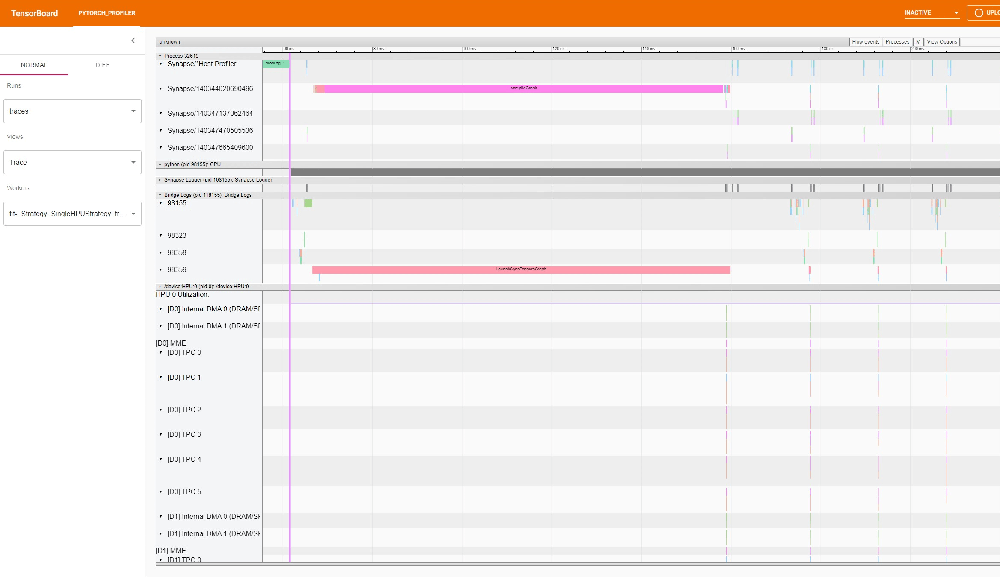
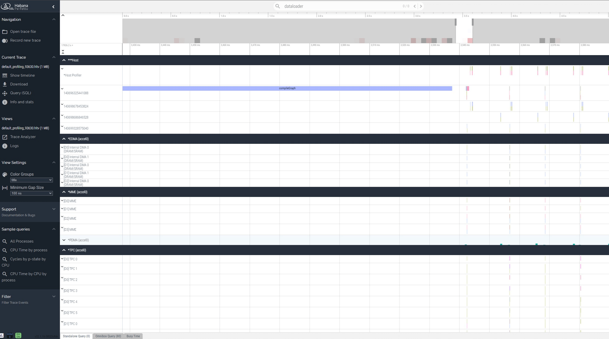

:orphan:

.. _hpu_advanced:

Accelerator: HPU Training
=========================
This document offers instructions to Gaudi chip users who want to use advanced strategies and profiling HPUs.

----

Using HPUProfiler
-----------------

HPUProfiler is a Lightning implementation of PyTorch profiler for HPU. It aids in obtaining profiling summary of PyTorch functions.
It subclasses PyTorch Lightning's `PyTorch profiler <https://lightning.ai/docs/pytorch/stable/api/pytorch_lightning.profilers.PyTorchProfiler.html>`_.

.. note::
    It is recommended to import lightning_habana before lightning to initialize the environment of custom habana profiler

Default Profiling
^^^^^^^^^^^^^^^^^^
For auto profiling, create an ``HPUProfiler`` instance and pass it to the trainer.
At the end of ``profiler.fit()``, it will generate a JSON trace for the run.
In case ``accelerator= HPUAccelerator()`` is not used with ``HPUProfiler``, it will dump only CPU traces, similar to ``PyTorchProfiler``.

.. code-block:: python

    from lightning import Trainer
    from lightning_habana.pytorch.accelerator import HPUAccelerator
    from lightning_habana.pytorch.profiler.profiler import HPUProfiler

    trainer = Trainer(accelerator=HPUAccelerator(), profiler=HPUProfiler())

Distributed Profiling
^^^^^^^^^^^^^^^^^^^^^^

To profile a distributed model, use ``HPUProfiler`` with the filename argument which will save a report per rank.

.. code-block:: python

    from lightning import Trainer
    from lightning_habana.pytorch.accelerator import HPUAccelerator
    from lightning_habana.pytorch.profiler.profiler import HPUProfiler

    profiler = HPUProfiler(filename="perf-logs")
    trainer = Trainer(profiler=profiler, accelerator=HPUAccelerator())

Custom Profiling
^^^^^^^^^^^^^^^^^

To `profile custom actions of interest <https://pytorch-lightning.readthedocs.io/en/stable/tuning/profiler_expert.html#profile-custom-actions-of-interest>`_,
reference a profiler in the ``LightningModule``.

.. code-block:: python

    from lightning import Trainer
    from lightning_habana.pytorch.accelerator import HPUAccelerator
    from lightning_habana.pytorch.profiler.profiler import HPUProfiler

    # Reference profiler in LightningModule
    class MyModel(LightningModule):
        def __init__(self, profiler=None):
            self.profiler = profiler

    # To profile in any part of your code, use the self.profiler.profile() function
        def custom_processing_step_basic(self, data):
            with self.profiler.profile("my_custom_action"):
                print("do something")
            return data

    # Alternatively, use self.profiler.start("my_custom_action")
    # and self.profiler.stop("my_custom_action") functions
    # to enclose the part of code to be profiled.
        def custom_processing_step_granular(self, data):
            self.profiler.start("my_custom_action")
            print("do something")
            self.profiler.stop("my_custom_action")
            return data

    # Pass profiler instance to LightningModule
    profiler = HPUProfiler()
    model = MyModel(profiler)
    trainer = Trainer(accelerator=HPUAccelerator(), profiler=profiler)

For more details on Profiler, refer to `PyTorchProfiler <https://pytorch-lightning.readthedocs.io/en/stable/tuning/profiler_intermediate.html>`_

Visualizing Profiled Operations
^^^^^^^^^^^^^^^^^^^^^^^^^^^^^^^^

Profiler dumps traces in JSON format. The traces can be visualized in 2 ways as described below.

Using PyTorch TensorBoard Profiler
""""""""""""""""""""""""""""""""""

For further instructions see, https://github.com/pytorch/kineto/tree/master/tb_plugin.

1. Install tensorboard

.. code-block:: bash

    python -um pip install tensorboard torch-tb-profiler

2. Start the TensorBoard server (default at port 6006)

.. code-block:: bash

    tensorboard --logdir ./tensorboard --port 6006

3. Open the following URL in your browser: `http://localhost:6006/#profile`.

Using Chrome
"""""""""""""

    1. Open Chrome and paste this URL: `chrome://tracing/`.
    2. Once tracing opens, click on `Load` at the top-right and load one of the generated traces.

    HPUProfiler trace for torch.nn.Linear on tensorboard

Limitations
^^^^^^^^^^^^

- When using ``HPUProfiler``, wall clock time will not be representative of the true wall clock time. This is due to forcing profiled operations to be measured synchronously, when many HPU ops happen asynchronously.
  It is recommended to use this Profiler to find bottlenecks/breakdowns, however for end to end wall clock time use the ``SimpleProfiler``.

- ``HPUProfiler.summary()`` is not supported.

- Passing the Profiler name as a string "hpu" to the trainer is not supported.

----

Using Intel Gaudi Profiler
--------------------------

The Intel Gaudi Profiling subsystem, and the Profiling Configuration tools are methods to configure Intel Gaudi Profiler. To use Intel Gaudi Profiler, set `HABANA_PROFILE`, and run the lightning script as usual. This will dump a hltv trace file in the working directly. This can be viewed by loading it at https://perfetto.habana.ai/.

Intel Gaudi Profiler profiles the whole process as compared to HPUProfiler that profiles events only when the trainer is active, and therefore is useful for getting additional information in host trace.
It however does not provide traces for Lightning Python code. Use HPUProfiler to obtain those traces. The device traces on habana devices are identical for both profilers.

Please refer to `Getting Started with Intel Gaudi Profiler <https://docs.habana.ai/en/latest/Profiling/Intel_Gaudi_Profiling/Getting_Started_with_Profiler.html>`_ for more information.

.. note::

    ``HPUProfiler`` and Intel Gaudi Profiler should not be used together. Therefore, `HABANA_PROFILE` should not be set in environment when using ``HPUProfiler``.

    Intel Gaudi Profiler trace for torch.nn.Linear on perfetto

----

Using DeepSpeed
------------------------

HPU supports advanced optimization libraries like ``deepspeed``. The HabanaAI GitHub has a fork of the DeepSpeed library that includes changes to add support for SynapseAI.

Installing DeepSpeed for HPU
^^^^^^^^^^^^^^^^^^^^^^^^^^^^^

To use DeepSpeed with Lightning on Gaudi, you must install Habana's fork for DeepSpeed.
To install the latest supported version of DeepSpeed, follow the instructions at https://docs.habana.ai/en/latest/PyTorch/DeepSpeed/DeepSpeed_User_Guide/DeepSpeed_User_Guide.html#installing-deepspeed-library

Using DeepSpeed on HPU
^^^^^^^^^^^^^^^^^^^^^^^^^^^^^

In Lightning, DeepSpeed functionalities are enabled for HPU via HPUDeepSpeedStrategy. By default, HPU training uses 32-bit precision. To enable mixed precision, set the ``precision`` flag.
A basic example of HPUDeepSpeedStrategy invocation is shown below.

.. code-block:: python

    class DemoModel(LightningModule):

        ...

        def configure_optimizers(self) -> Tuple[List[torch.optim.Optimizer], List[_TORCH_LRSCHEDULER]]:
            optimizer = torch.optim.SGD(self.layer.parameters(), lr=0.1)
            lr_scheduler = torch.optim.lr_scheduler.StepLR(optimizer, step_size=1)
            return [optimizer], [lr_scheduler]

    model = DemoModel()
    _plugins = [DeepSpeedPrecisionPlugin(precision="bf16-mixed")]
    trainer = Trainer(
        accelerator=HPUAccelerator(), strategy=HPUDeepSpeedStrategy(),
        callbacks=[TestCB()], max_epochs=1, plugins=_plugins,
    )
    trainer.fit(model)

.. note::

   1. accelerator="auto" or accelerator="hpu" is not yet enabled with lightning>2.0.0 and lightning-habana.
   2. Passing strategy in a string representation ("hpu_deepspeed", "hpu_deepspeed_stage_1", etc.. ) are not yet enabled.

DeepSpeed Configurations
^^^^^^^^^^^^^^^^^^^^^^^^^

Below is a summary of all the DeepSpeed configurations supported by HPU. For full details on the HPU supported DeepSpeed features and functionalities, refer to `Using DeepSpeed with HPU <https://docs.habana.ai/en/latest/PyTorch/DeepSpeed/index.html>`_.
All further information on DeepSpeed configurations can be found in DeepSpeed<https://www.deepspeed.ai/training/#features> documentation.

* ZeRO-1

* ZeRO-2

* ZeRO-3

* ZeRO-Offload

* ZeRO-Infinity

* BF16 precision

* BF16Optimizer

* Activation Checkpointing

The HPUDeepSpeedStrategy can be configured using its arguments or a JSON configuration file. Both configuration methods are shown in the examples below.

ZeRO-1
""""""
.. code-block:: python

    from lightning.pytorch.plugins import DeepSpeedPrecisionPlugin
    from lightning_habana.pytorch.accelerator import HPUAccelerator
    from lightning_habana.pytorch.strategies import HPUDeepSpeedStrategy

    trainer = Trainer(devices=8, accelerator=HPUAccelerator(), strategy=HPUDeepSpeedStrategy(zero_optimization=True, stage=1), plugins=[DeepSpeedPrecisionPlugin(precision="bf16-mixed")])

ZeRO-2
""""""
.. code-block:: python

    from lightning.pytorch.plugins import DeepSpeedPrecisionPlugin
    from lightning_habana.pytorch.accelerator import HPUAccelerator
    from lightning_habana.pytorch.strategies import HPUDeepSpeedStrategy

    trainer = Trainer(devices=8, accelerator=HPUAccelerator(), strategy=HPUDeepSpeedStrategy(zero_optimization=True, stage=2), plugins=[DeepSpeedPrecisionPlugin(precision="bf16-mixed")])

ZeRO-3
""""""
.. code-block:: python

    from lightning.pytorch.plugins import DeepSpeedPrecisionPlugin
    from lightning_habana.pytorch.accelerator import HPUAccelerator
    from lightning_habana.pytorch.strategies import HPUDeepSpeedStrategy

    trainer = Trainer(devices=8, accelerator=HPUAccelerator(), strategy=HPUDeepSpeedStrategy(zero_optimization=True, stage=3), plugins=[DeepSpeedPrecisionPlugin(precision="bf16-mixed")])

ZeRO-Offload
""""""""""""
.. code-block:: python

    from lightning.pytorch.plugins import DeepSpeedPrecisionPlugin
    from lightning_habana.pytorch.accelerator import HPUAccelerator
    from lightning_habana.pytorch.strategies import HPUDeepSpeedStrategy

    trainer = Trainer(devices=8, accelerator=HPUAccelerator(), strategy=HPUDeepSpeedStrategy(zero_optimization=True, stage=2, offload_optimizer=True), plugins=[DeepSpeedPrecisionPlugin(precision="bf16-mixed")])

ZeRO-Infinity
""""""""""""""
.. code-block:: python

    from lightning.pytorch.plugins import DeepSpeedPrecisionPlugin
    from lightning_habana.pytorch.accelerator import HPUAccelerator
    from lightning_habana.pytorch.strategies import HPUDeepSpeedStrategy

    trainer = Trainer(devices=8, accelerator=HPUAccelerator(), strategy=HPUDeepSpeedStrategy(zero_optimization=True, stage=2, offload_optimizer=True), plugins=[DeepSpeedPrecisionPlugin(precision="bf16-mixed")])

BF16 precision
""""""""""""""

.. code-block:: python

    from lightning.pytorch.plugins import DeepSpeedPrecisionPlugin
    from lightning_habana.pytorch.accelerator import HPUAccelerator
    from lightning_habana.pytorch.strategies import HPUDeepSpeedStrategy

    trainer = Trainer(devices=8, accelerator=HPUAccelerator(), strategy=HPUDeepSpeedStrategy(), plugins=[DeepSpeedPrecisionPlugin(precision="bf16-mixed")])

BF16-Optimizer
""""""""""""""
This example demonstrates how the HPUDeepSpeedStrategy can be configured using a DeepSpeed json configuration.

.. code-block:: python

    from lightning.pytorch import LightningModule, Trainer
    from lightning_habana.pytorch.accelerator import HPUAccelerator
    from lightning_habana.pytorch.strategies import HPUDeepSpeedStrategy

    config = {
        "train_batch_size": 8,
        "bf16": {
            "enabled": True
        },
        "fp16": {
            "enabled": False
        },
        "train_micro_batch_size_per_gpu": 2,
        "scheduler": {
            "type": "WarmupDecayLR",
            "params": {
            "warmup_min_lr": 0.02,
            "warmup_max_lr": 0.05,
            "warmup_num_steps": 4,
            "total_num_steps" : 8,
            "warmup_type": "linear"
            }
        },
        "zero_allow_untested_optimizer": True,
        "zero_optimization": {"stage" : 2}
    }

    class SampleModel(LightningModule):
        ...

        def configure_optimizers(self):
            from torch.optim.adamw import AdamW as AdamW
            optimizer = torch.optim.AdamW(self.parameters())
            return optimizer

    _plugins = [DeepSpeedPrecisionPlugin(precision="bf16-mixed")]
    _accumulate_grad_batches=2
    _parallel_hpus = [torch.device("hpu")] * HPUAccelerator.auto_device_count()

    model = SampleModel()
    trainer = Trainer(
        accelerator=HPUAccelerator(), strategy=HPUDeepSpeedStrategy(config=config, parallel_devices=_parallel_hpus),
        enable_progress_bar=False,
        fast_dev_run=8,
        plugins=_plugins,
        use_distributed_sampler=False,
        limit_train_batches=16,
        accumulate_grad_batches=_accumulate_grad_batches,
    )

    trainer.fit(model)

.. note::

   1. When the optimizer and/or scheduler configuration is specified in both LightningModule and DeepSpeed json configuration file, preference will be given to the optimizer/scheduler returned by LightningModule::configure_optimizers().

Activation Checkpointing
""""""""""""""""""""""""

.. code-block:: python

    from lightning.pytorch import LightningModule, Trainer
    from lightning_habana.pytorch.accelerator import HPUAccelerator
    from lightning_habana.pytorch.strategies import HPUDeepSpeedStrategy
    from deepspeed.runtime.activation_checkpointing.checkpointing import checkpoint

    class SampleModel(LightningModule):
        def __init__(self):
            super().__init__()
            self.l1 = nn.Linear(32)
            self.l2 = nn.Linear(32)

        def forward(self, x):
            l1_out = self.l1(x)
            l2_out = checkpoint(self.l2, l1_out)
            return l2_out

    trainer = Trainer(accelerator=HPUAccelerator(),
                        strategy=HPUDeepSpeedStrategy(zero_optimization=True,
                                                        stage=3,
                                                        offload_optimizer=True,
                                                        cpu_checkpointing=True),
                        plugins=[DeepSpeedPrecisionPlugin(precision="bf16-mixed")]
                    )

DeepSpeed inference on HPU
^^^^^^^^^^^^^^^^^^^^^^^^^^^^^

HPUDeepSpeedStrategy can be used for inference with DeepSpeed on HPU.
For more information, refer to `Inference Using DeepSpeed <https://docs.habana.ai/en/latest/PyTorch/DeepSpeed/Inference_Using_DeepSpeed.html>`__.

The following options can be used to initialize inference.

Using Arguments
""""""""""""""""

.. code-block:: python

    model = InferenceSample()
    _parallel_hpus = [torch.device("hpu")] * 8

    trainer = Trainer(
        accelerator=HPUAccelerator(),
        devices=8,
        strategy=HPUDeepSpeedStrategy(
            parallel_devices=8,
            tensor_parallel={"tp_size": 8},
            dtype=torch.float,
            replace_with_kernel_inject=True,
        ),
        plugins=[DeepSpeedPrecisionPlugin(precision="bf16-mixed")],
        use_distributed_sampler=False,
    )
    trainer.predict(model)

Using Kwargs
""""""""""""""

.. code-block:: python

    model = InferenceSample()
    kwargs = {"dtype": torch.float}
    kwargs["tensor_parallel"] = {"tp_size": 4}
    kwargs["enable_cuda_graph"] = False
    kwargs["replace_method"] = "auto"
    kwargs["replace_with_kernel_inject"] = False
    kwargs["injection_policy"] = {InferenceSample: ("l1")}
    _parallel_hpus = [torch.device("hpu")] * 4

    trainer = Trainer(
        accelerator=HPUAccelerator(),
        devices=4,
        strategy=HPUDeepSpeedStrategy(parallel_devices=_parallel_hpus, **kwargs),
        plugins=[DeepSpeedPrecisionPlugin(precision="bf16-mixed")],
        use_distributed_sampler=False,
    )
    trainer.predict(model)

Using Configuration
""""""""""""""""""""""

.. code-block:: python

    model = InferenceSample()
    _parallel_hpus = [torch.device("hpu")] * 8

    _config = {
        "replace_with_kernel_inject": True,
        "tensor_parallel": {"tp_size": 4},
        "dtype": torch.float,
        "enable_cuda_graph": False,
    }

    trainer = Trainer(
        accelerator=HPUAccelerator(),
        devices=8,
        strategy=HPUDeepSpeedStrategy(
            parallel_devices=_parallel_hpus,
            config=_config,
        ),
        plugins=[DeepSpeedPrecisionPlugin(precision="bf16-mixed")],
        use_distributed_sampler=False,
    )
    trainer.predict(model)

Limitations of DeepSpeed on HPU
^^^^^^^^^^^^^^^^^^^^^^^^^^^^^^^^^^^^
   1. DeepSpeed Zero Stage 3 is not yet supported by Gaudi2.
   2. Offloading to Nvme is not yet verified on HPU with DeepSpeed Zero Stage 3 Offload configuration.
   3. Model Pipeline and Tensor Parallelism are currently supported only on Gaudi2.
   4. DeepSpeed inference with float16 is not supported on Gaudi1.

For further details on the supported DeepSpeed features and functionalities, refer to `Using DeepSpeed with HPU <https://docs.habana.ai/en/latest/PyTorch/DeepSpeed/index.html>`_.

----

Using FSDP on HPU
-------------------------

Fully Sharded Data Parallel (FSDP) is supported by Intel Gaudi 2 AI accelerator for running distributed training on large-scale models.

To enable FSDP training on HPU, use HPUFSDPStrategy:

.. code-block:: python

    from lightning_habana.pytorch.strategies import HPUFSDPStrategy
    from lightning_habana.pytorch.plugins.fsdp_precision import HPUFSDPPrecisionPlugin

    strategy=HPUFSDPStrategy(parallel_devices=[torch.device("hpu")] * 8,
                                sharding_strategy="FULL_SHARD",
                                precision_plugin=HPUFSDPPrecisionPlugin("bf16-mixed")
                            )
    trainer = Trainer(accelerator=HPUAccelerator(), strategy=strategy, fast_dev_run=10, enable_model_summary=True)

Choose Sharding Strategy
^^^^^^^^^^^^^^^^^^^^^^^^^

Sharding stragey can be configured to control the way model parameters, gradients, and optimizer states are sharded. Sharding strategy can be one of the four values as shown below.

#. "FULL_SHARD"     -   Default: Shard weights, gradients, optimizer state (1 + 2 + 3)
#. "SHARD_GRAD_OP"  -   Shard gradients, optimizer state (2 + 3)
#. "HYBRID_SHARD"   -   Full-shard within a machine, replicate across machines
#. "NO_SHARD"       -   Don't shard anything (similar to DDP)

.. code-block:: python

    strategy = HPUFSDPStrategy(
        sharding_strategy="FULL_SHARD",
        ...,
    )
    trainer = Trainer(..., strategy=strategy)

Here is a sample code for Scaling Gaudi with PyTorch using the Fully Sharded Data Parallelism (FSDP) approach.

.. code-block:: python

    class MyModel(BoringModel):
        def configure_model(self):
            self.layer = torch.nn.Linear(32, 2)

        def configure_optimizers(self):
            return torch.optim.AdamW(self.layer.parameters(), lr=0.1)

    _strategy=HPUFSDPStrategy(
        parallel_devices=[torch.device("hpu")] * 8,
        sharding_strategy="SHARD_GRAD_OP",
        precision_plugin=HPUFSDPPrecision("bf16-mixed"))

    trainer = Trainer(
        default_root_dir=tmpdir,
        accelerator=HPUAccelerator(),
        devices=hpus,
        strategy=_strategy,
        max_epochs=1,
    )

Limitations of FSDP on HPU
^^^^^^^^^^^^^^^^^^^^^^^^^^^^^^^^^^^^
   1. This is an experimental feature.
   2. Saving/loading checkpoint using FSDP strategy is not fully enabled.
   3. If you encounter stability issues when running your model with FSDP, set PT_HPU_EAGER_PIPELINE_ENABLE=false flag.

For more details on the supported FSDP features and functionalities, and limitations refer to `Using Fully Sharded Data Parallel (FSDP) with Intel Gaudi <https://docs.habana.ai/en/latest/PyTorch/PyTorch_FSDP/Pytorch_FSDP.html>`_.

.. note::

    This is an experimental feature.
    This feature requires lightning/pytorch-lightning >= 2.3.0 or install nightly from the source.

----

Using HPU Graphs
------------------------

HPU Graphs reduce training and inference time for large models running in Lazy Mode. HPU Graphs bypasses all op accumulations by recording a static version of the entire graph, then replaying it.
The speedup achieved by using HPU Graphs depends on the underlying model. HPU Graphs reduce host overhead significantly, and can be used to speed up the process when it is host bound.

For further details, refer to `Using HPU Graphs for Training <https://docs.habana.ai/en/latest/PyTorch/Model_Optimization_PyTorch/HPU_Graphs_Training.html>`_ and `Run Inference Using HPU Graphs <https://docs.habana.ai/en/latest/PyTorch/Inference_on_PyTorch/Inference_Using_HPU_Graphs.html>`_

HPU Graphs APIs for Training
^^^^^^^^^^^^^^^^^^^^^^^^^^^^

The following section describes the usage of HPU Graph APIs in a training model.

Capture and Replay Training
"""""""""""""""""""""""""""

These are the APIs for manually capturing and replaying HPU Graphs. The capture phase involves recording all the forward and backward passes, then, replaying it again and again in the actual training phase.
An optional warmup phase may be added before capture phase.

Basic API usage:

#. Create a HPUGraph instance.
#. Create placeholders for input and target. These have to be compliant with batch_size and input / target dimensions.
#. Capture graph by wrapping the required portion of training step in HPUGraph ContextManager in first pass. Alternatively, `HPUGraph.capture_begin()` and `HPUGraph.capture_end()` can be used to wrap the module. A warmup pass may be used before capture begins.
#. Finally replay the graph for remaining iterations.

.. code-block:: python

    class HPUGraphsModel(LightningModule):
        def __init__(self, batch_size=_batch_size):
            """init"""
            super().__init__()
            # Create a HPUGraph instance
            self.g = htcore.hpu.HPUGraph()
            # Placeholders for capture. Should be compliant with data and target dims
            self.static_input = torch.rand(device="hpu")
            self.static_target = torch.rand(device="hpu")
            # result is available in static_loss tensor after graph is replayed
            self.static_loss = None
            # Set manual optimization training
            self.automatic_optimization = False
            self.training_step = self.train_with_capture_and_replay

        def train_with_capture_and_replay(self, batch, batch_idx):
            """Manual optimization training step"""
            if batch_idx == 0 and self.current_epoch == 0:
                optimizer.zero_grad(set_to_none=True)
                # Capture graphs using HPUGraph ContextManager.
                # Alternatively, use HPUGraph.capture_begin() and HPUGraph.capture_end()
                with htcore.hpu.graph(self.g):
                    static_y_pred = self(self.static_input)
                    self.static_loss = F.cross_entropy(static_y_pred, self.static_target)
                    self.static_loss.backward()
                    optimizer.step()
                    return self.static_loss
            else:
                # Replay the graph
                # data must be copied to existing tensors that were used in the capture phase
                data, target = batch
                self.static_input.copy_(data)
                self.static_target.copy_(target)
                self.g.replay()
                self.log("train_loss", self.static_loss)
                return self.static_loss

make_graphed_callables
""""""""""""""""""""""

The `make_graphed_callables` API can be used to wrap a module into a standalone graph.
It accepts a callable module, sample_args, and warmup steps as inputs.
This API also requires the model to have only tuples for tensors as input and output. This is incompatible with workloads using data structures such as dicts and lists.

.. code-block:: python

    # model and sample_args as input to make_graphed_callables.
    model = HPUGraphsModel().to(torch.device("hpu"))
    x = torch.randn()
    model = htcore.hpu.make_graphed_callables(model, (x,))
    trainer.fit(model, data_module)

ModuleCacher
""""""""""""

This API provides another way of wrapping the model and handles dynamic inputs in a training model. `ModuleCacher` internally keeps track of whether an input shape has changed, and if so, creates a new HPU graph.
`ModuleCacher` is the recommended method for using HPU Graphs in training.
`max_graphs` specifies the number of graphs to cache. A larger amount will increase the number of cache hits but will result in higher memory usage.

.. code-block:: python

    # model is given an input to ModuleCacher.
    model= HPUGraphsModel()
    htcore.hpu.ModuleCacher(max_graphs)(model=model, inplace=True)
    trainer.fit(model, data_module)

HPU Graphs APIs for Inference
^^^^^^^^^^^^^^^^^^^^^^^^^^^^^

The following section describes the usage of HPU Graph APIs in an inference model.

Capture and Replay Inference
""""""""""""""""""""""""""""

The implementation is similar to Capture and Replay in training.

#. Create a HPUGraph instance.
#. Create placeholders for input, target and predictions.
#. Capture graph by wrapping the required portion of test / validation step in HPUGraph ContextManager in first pass.
#. Finally replay the graph for remaining iterations.

.. code-block:: python

    class HPUGraphsModel(LightningModule):
        def __init__(self, batch_size=_batch_size):
            """init"""
            super().__init__()
            # Create a HPUGraph object
            self.g = htcore.hpu.HPUGraph()
            # Placeholders for capture. Should be compliant with data and target dims
            self.static_input = torch.rand(device="hpu")
            self.static_target = torch.rand(device="hpu")
            # Placeholder to store predictions after graph is replayed
            self.static_y_pred = torch.rand(device="hpu")
            # loss is available in static_loss tensor after graph is replayed
            self.static_loss = None

        def test_step(self, batch, batch_idx):
            """Test step"""
            x, y = batch
            if batch_idx == 0:
                with htcore.hpu.graph(self.g):
                    static_y_pred = self.forward(self.static_input)
                    self.static_loss = F.cross_entropy(static_y_pred, self.static_target)
            else:
                self.static_input.copy_(x)
                self.static_target.copy_(y)
                self.g.replay()

wrap_in_hpu_graph
"""""""""""""""""

This is an alternative to manual capturing and replaying HPU Graphs.
`htorch.hpu.wrap_in_hpu_graph` can be used to wrap module forward function with HPU Graphs.
This wrapper captures, caches and replays the graph.
Setting `disasble_tensor_cache` to `True` will release cached output tensor memory after every replay.
`asynchronous` specifies whether the graph capture and replay should be asynchronous.

.. code-block:: python

    model = NetHPUGraphs(mode=mode).to(torch.device("hpu"))
    model =  htcore.hpu.wrap_in_hpu_graph(model, asynchronous=False, disable_tensor_cache=True)
    trainer.test(model, data_module)

HPU Graphs and Dynamicity in Models
^^^^^^^^^^^^^^^^^^^^^^^^^^^^^^^^^^^

Dynamicity, resulting from changing input shapes or dynamic ops, can lead to multiple recompilations, causing longer training time and reducing performance.

HPU Graphs do not support dynamicity in models. `ModuleCacher` can handle dynamic inputs automatically, but it does not handle dynamic control flow and dynamic ops.

However, one can split the module into static and dynamic portions and use HPU Graphs in static regions.

For further details, refer to `Dynamicity in Models <https://docs.habana.ai/en/latest/PyTorch/Model_Optimization_PyTorch/HPU_Graphs_Training.html#dynamicity-in-models>`_

Dynamic Control Flow
""""""""""""""""""""

When dynamic control flow is present, the model needs to be separated into different HPU Graphs.
In the example below, the output of module1 feeds module2 or module3 depending on the dynamic control flow.

.. code-block:: python

    class HPUGraphsModel(LightningModule):
        def __init__(self, mode=None, batch_size=None):
            """init"""
            super(NetHPUGraphs, self).__init__()
            # Break Model into separate HPU Graphs for each control flow.
            self.module1 = NetHPUGraphs()
            self.module2 = nn.Identity()
            self.module3 = nn.ReLU()
            htcore.hpu.ModuleCacher(max_graphs)(model=self.module1, inplace=True)
            htcore.hpu.ModuleCacher(max_graphs)(model=self.module2, inplace=True)
            htcore.hpu.ModuleCacher(max_graphs)(model=self.module3, inplace=True)
            self.automatic_optimization = False
            self.training_step = self.dynamic_control_flow_training_step

        def dynamic_control_flow_training_step(self, batch, batch_idx):
            """Training step with HPU Graphs and Dynamic control flow"""
            optimizer = self.optimizers()
            data, target = batch
            optimizer.zero_grad(set_to_none=True)
            # Train with HPU Graph
            tmp = self.module1(data)

            # dynamic control flow
            if random.random() > 0.5:
                tmp = self.module2(tmp)  # forward ops run as a graph
            else:
                tmp = self.module3(tmp)  # forward ops run as a graph

            loss = F.cross_entropy(tmp, target)
            loss.backward()
            optimizer.step()
            self.log("train_loss", loss)
            return loss

Dynamic Ops
"""""""""""

In this example we have module1 -> dynamic boolean indexing -> module2.
Thus, both the static modules are placed into separate ModuleCacher and the dynamic op part is left out.

.. code-block:: python

    class HPUGraphsModel(LightningModule):
        def __init__(self, mode=None, batch_size=None):
            """init"""
            super(NetHPUGraphs, self).__init__()
            # Encapsulate dynamic ops between two separate HPU Graph modules,
            # instead of using one single HPU Graph for whole model
            self.module1 = NetHPUGraphs()
            self.module2 = nn.Identity()
            htcore.hpu.ModuleCacher(max_graphs)(model=self.module1, inplace=True)
            htcore.hpu.ModuleCacher(max_graphs)(model=self.module2, inplace=True)
            self.automatic_optimization = False
            self.training_step = self.dynamic_ops_training_step

        def dynamic_ops_training_step(self, batch, batch_idx):
            """Training step with HPU Graphs and Dynamic ops"""
            optimizer = self.optimizers()
            data, target = batch
            optimizer.zero_grad(set_to_none=True)
            # Train with HPU graph module
            tmp = self.module1(data)

            # Dynamic op
            htcore.mark_step()
            tmp = tmp[torch.where(tmp < 0)]
            htcore.mark_step()

            # Resume training with HPU graph module
            tmp = self.module2(tmp)
            loss = F.cross_entropy(tmp, target)
            loss.backward()
            optimizer.step()
            self.log("train_loss", loss)
            return loss

Limitations of HPU Graphs
^^^^^^^^^^^^^^^^^^^^^^^^^

* Using HPU Graphs with `torch.compile` is not supported.

Please refer to `Limitations of HPU Graphs <https://docs.habana.ai/en/latest/PyTorch/Model_Optimization_PyTorch/HPU_Graphs_Training.html#limitations-of-hpu-graph-apis>`_

----

Using ``torch.compile``
------------------------

PyTorch Eager mode and Eager mode with `torch.compile` are available for early preview.
The following compile backend is now available to support training & inference on HPU: `hpu_backend` .

.. code-block:: python

    compiled_train_model = torch.compile(model_to_train, backend="hpu_backend")
    compiled_eval_model = torch.compile(model_to_eval, backend="hpu_backend")

Please refer to `GAUDI Release Notes <https://docs.habana.ai/en/latest/Release_Notes/GAUDI_Release_Notes.html>`_

----

Support for Multiple tenants
------------------------------

Running a workload with partial Gaudi processors can be enabled with a simple environment variable setting `HABANA_VISIBLE_MODULES`.
In general, there are eight Gaudi processors on a node, so the module IDs would be in the range of 0 ~ 7.

To run a 4-Gaudi workload, set this in environment before running the workload:

.. code-block:: bash

    export HABANA_VISIBLE_MODULES="0,1,2,3"

To run another 4-Gaudi workload in parallel, set the modules as follows before running the second workload:

.. code-block:: bash

    export HABANA_VISIBLE_MODULES="4,5,6,7"

In addition to setting `HABANA_VISIBLE_MODULES`, also set a unique `MASTER_PORT` as environment variable for each tenant instance.

Please refer to `Multiple Workloads on a Single Docker <https://docs.habana.ai/en/latest/PyTorch/Reference/PT_Multiple_Tenants_on_HPU/Multiple_Workloads_Single_Docker.html>`_

----

Metric APIs
--------------

The Metric APIs provide various performance-related metrics, such as the number of graph compilations, the total time of graph compilations, and more.
Please refer to `Metric APIs <https://docs.habana.ai/en/latest/PyTorch/Reference/Python_Packages.html#metric-apis>`_ for more information.
